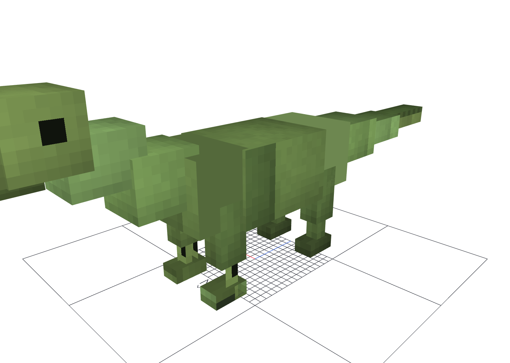

# Minecraft Survival Evolved

Mod para Minecraft 26.1.2 sobre NeoForge 26.1.2.84, Java 25 y GeckoLib 5.

## Estado actual

- ID: `mc_evolved`
- paquete base: `com.wachi.mse`
- clase principal: `MseMod`
- Mixins configurados en `mc_evolved.mixins.json`
- entidad GeckoLib inicial: `mc_evolved:prototype_dinosaur`

El primer prototipo incluye un modelo temporal, textura pixel art, animaciones
`idle` y `walk`, atributos y una IA mínima de paseo. Se puede invocar con:

```mcfunction
/summon mc_evolved:prototype_dinosaur ~ ~ ~
```



## Desarrollo

Compila y ejecuta las comprobaciones con:

```powershell
.\gradlew.bat clean build
```

El proyecto editable de Blockbench está en
`art/blockbench/prototype_dinosaur/prototype_dinosaur.bbmodel`. Los recursos
exportados que carga GeckoLib están bajo `src/main/resources/assets/mc_evolved/`.
Los `.bbmodel` se excluyen deliberadamente del JAR.

La arquitectura y el orden de implementación del sistema procedural están
documentados en `docs/dinosaur_procedural_animation_plan.md`.
